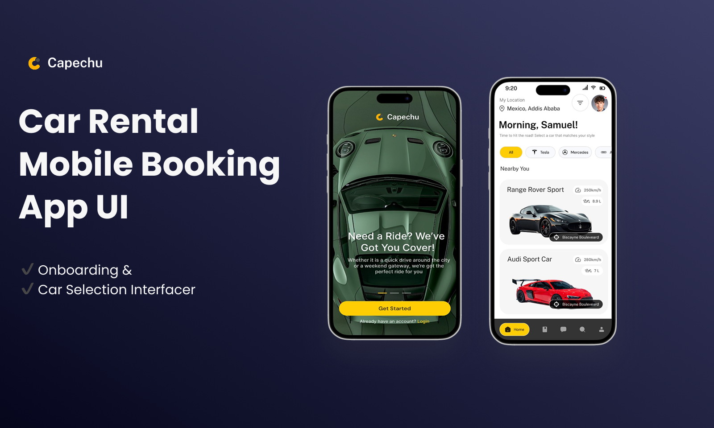
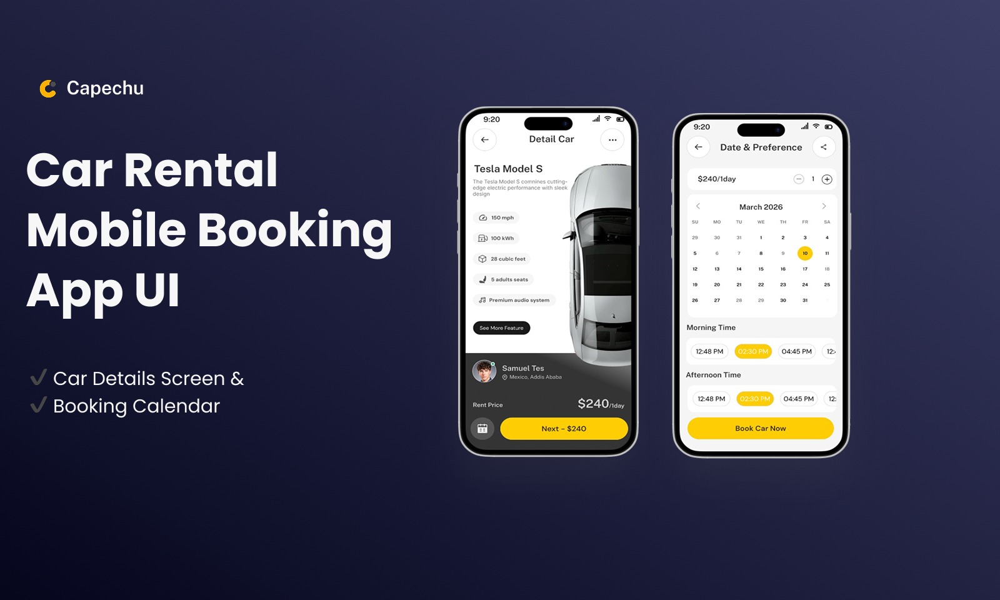
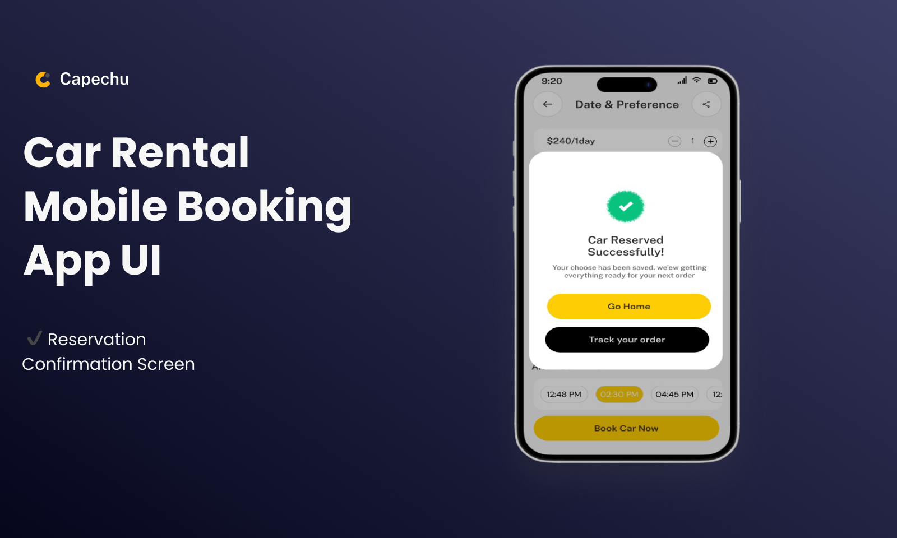

# FUTURE_UX_02

# 🚗 Car Rental Mobile Booking App UI

A modern **Car Rental Mobile Booking App UI design** created to provide users with a smooth and intuitive experience when searching and reserving rental cars. The design focuses on simplicity, clarity, and an efficient booking flow to help users quickly find and reserve their preferred vehicle.

---

## ✨ Features

✔ **Onboarding & Login Flow**
User-friendly introduction screens with a simple login and account access experience.

✔ **Home Screen**
Browse available cars and featured rental options.

✔ **Car Details Screen**
View detailed information about each car including specifications and rental details.

✔ **Car Selection Interface**
Allows users to easily choose their preferred vehicle.

✔ **Booking Calendar**
Select rental dates using a simple and intuitive calendar interface.

✔ **Reservation Confirmation Screen**
Displays booking confirmation after a successful reservation.

---

## 🎨 Design Highlights

* Clean and modern **mobile UI layout**
* Simple and intuitive **user booking flow**
* Focused on **user-friendly navigation**
* Custom **hand‑drawn illustrations**
* Designed for a **mobile‑first experience**

---

## 🛠 Design Tool

* **Figma** – Used to design the full mobile UI interface.

---

## 📸 Preview

### Onboarding & Car Selection Interfacer
 

<table>
  <tr>
    <td valign="top">
      
    </td>
 </table>

---
### Car Details Screen & Booking Calendar
 

<table>
  <tr>
    <td valign="top">
      
    </td>
 </table>

---
### Reservation Confirmation Screen

<table>
  <tr>
    <td valign="top">
      
    </td>
 </table>

---

## 📌 Project Purpose

This project was created as a **UI/UX design practice project** to showcase a modern car rental booking interface and demonstrate a clear mobile app user flow.

---

## 📄 License

This project is for **portfolio and educational purposes**.

---

## 🔗 Figma Design File

View the full interactive design here:

[Open Figma File](https://www.figma.com/proto/oG0j0EsApPwR67nnprfSXr/Car-Rental-Mobile-App-Design?node-id=1-2&t=TgK3gBh0qDEktzVq-1&scaling=scale-down&content-scaling=fixed&page-id=0%3A1)

---

⭐ If you like this design, feel free to **star the repository**.
